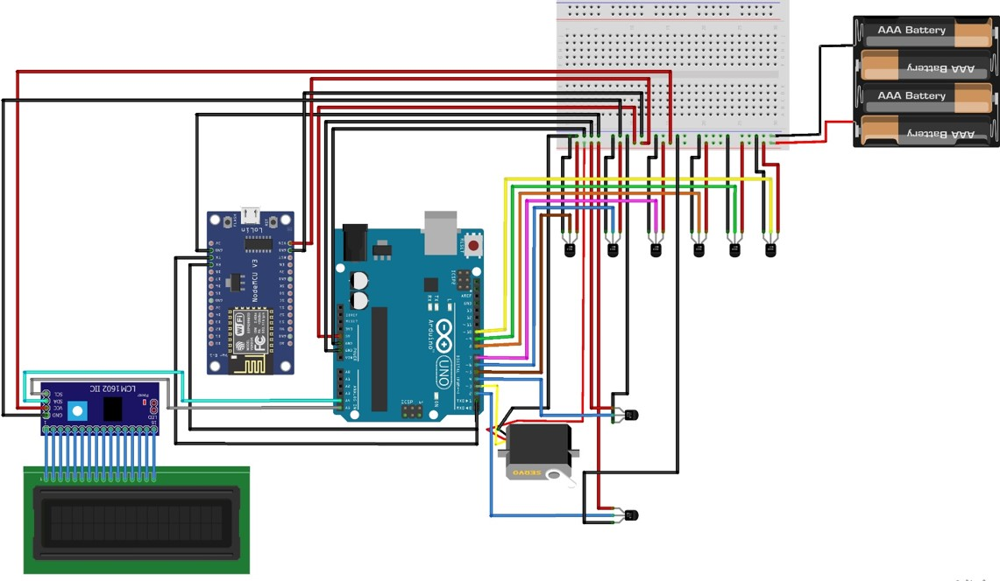
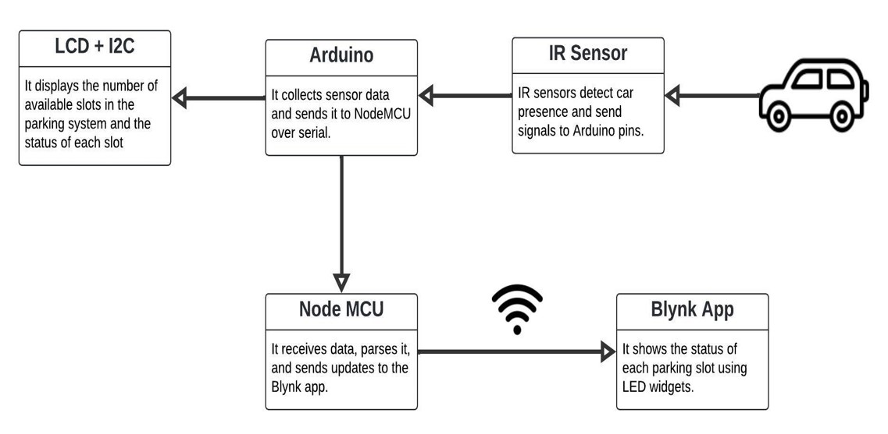

# Smart Vehicle Parking System

This project demonstrates a smart vehicle parking system that integrates an Arduino Uno, IR sensors, a Servo motor, a 20x4 LCD with I2C, and a NodeMCU for parking slot monitoring and real-time display through the Blynk IoT app.

## Components Used
- **Arduino Uno** – For controlling the sensors and motor.
- **NodeMCU** – For communicating parking status to the Blynk app.
- **Servo Motor** – Used to open and close the gate.
- **IR Sensors** – For detecting car presence in parking slots.
  - IR sensors for entrance/exit and 6 car slots.
- **20x4 LCD with I2C** – Displays the current parking availability.
- **Blynk IoT App** – Real-time monitoring of parking slots.

## Key Features
- **Automated Gate:** Controlled by a servo motor that opens/closes based on parking slot availability.
- **Slot Detection:** IR sensors detect car presence in 6 slots, updating the display and app in real-time.
- **LCD Display:** Shows available slots and status of each parking slot.
- **Blynk Integration:** Displays parking status via the Blynk IoT app using a NodeMCU.

## Installation and Setup



### Arduino Uno Setup
- Connect the IR sensors to pins 2, 4-10 on the Arduino.
- Connect the servo motor to pin 3.
- Set up the 20x4 LCD using I2C with address `0x27`.
- Install the necessary libraries:
  - `Servo.h` for controlling the servo motor.
  - `Wire.h` and `LiquidCrystal_I2C.h` for the LCD display.

```cpp
#include <Servo.h>
#include <Wire.h>
#include <LiquidCrystal_I2C.h>

// LCD setup with I2C address
LiquidCrystal_I2C lcd(0x27, 20, 4);
Servo myservo;

#define ir_enter 2
#define ir_back  4
#define ir_car1 5
#define ir_car2 6
#define ir_car3 7
#define ir_car4 8
#define ir_car5 9
#define ir_car6 10
```

## NodeMCU Setup
- Install the `BlynkEdgent.h` library for Blynk integration.
- Define virtual pins for the slots using the following mappings:
  - V0 to V5 for slot statuses S1 to S6.
- Set up serial communication between Arduino and NodeMCU to receive slot statuses.

```cpp
#define LED_V0 V0
#define LED_V1 V1
#define LED_V2 V2
#define LED_V3 V3
#define LED_V4 V4
#define LED_V5 V5
```

## Blynk Setup
- Create a Blynk project and use the following credentials:
  - **Template ID:** `TMPL3sx7MxDYJ`
  - **Template Name:** `MyNodeMCU`
  - **Auth Token:** `[Your Blynk Auth Token]`
- Set up virtual pins in the Blynk app to reflect the parking status:
  - V0 to V5 for each slot (S1 to S6).

## Serial Communication
- The Arduino sends a string of 6 digits to the NodeMCU, with each digit representing the status of a parking slot:
  - `1` = Slot is filled.
  - `0` = Slot is empty.
- The NodeMCU receives this data and updates the Blynk app in real-time to display the parking status.

## How It Works



### Slot Monitoring
- The IR sensors detect cars in each of the 6 parking slots.
- This data is displayed on the 20x4 LCD and sent to the NodeMCU via serial communication.

### Gate Control
- When a car approaches the gate (detected by the `ir_enter` sensor), the system checks for available parking slots.
- If a slot is available, the servo motor opens the gate to allow the car to enter.
- When a car leaves (detected by the `ir_back` sensor), the gate opens again, and the available slots are updated.

### Blynk App
- The NodeMCU updates the Blynk app in real-time with the status of each parking slot, making it accessible remotely.

## Code Overview

### Arduino Code
- Handles inputs from the IR sensors to detect car presence.
- Controls the servo motor for gate operation.
- Displays available parking slots on the LCD.
- Sends parking slot data (via serial communication) to the NodeMCU for updating the Blynk app.

### NodeMCU Code
- Receives slot statuses from the Arduino over serial communication.
- Updates the virtual pins in the Blynk app to reflect the status of parking slots.

## Future Enhancements
- **RFID Integration:** Implement an RFID system for user identification when entering/exiting the parking area.
- **Advanced Parking Allocation:** Develop a more advanced algorithm to optimize parking slot allocation.
- **System Expansion:** Increase the number of parking slots and scale the system for larger parking facilities.
